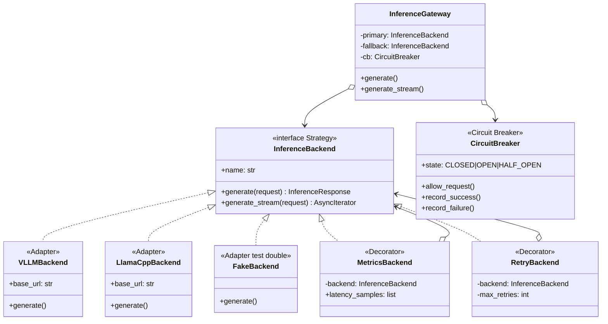

# Class Diagram — Inference Gateway

```mermaid
classDiagram
  class InferenceBackend {
    <<interface Strategy>>
    +name: str
    +generate(request) InferenceResponse
    +generate_stream(request) AsyncIterator
  }

  class VLLMBackend {
    <<Adapter>>
    +base_url: str
    +generate()
  }
  class LlamaCppBackend {
    <<Adapter>>
    +base_url: str
    +generate()
  }
  class FakeBackend {
    <<Adapter test double>>
    +generate()
  }

  class MetricsBackend {
    <<Decorator>>
    -backend: InferenceBackend
    +latency_samples: list
  }
  class RetryBackend {
    <<Decorator>>
    -backend: InferenceBackend
    -max_retries: int
  }

  class CircuitBreaker {
    <<Circuit Breaker>>
    +state: CLOSED|OPEN|HALF_OPEN
    +allow_request()
    +record_success()
    +record_failure()
  }

  class InferenceGateway {
    -primary: InferenceBackend
    -fallback: InferenceBackend
    -cb: CircuitBreaker
    +generate()
    +generate_stream()
  }

  InferenceBackend <|.. VLLMBackend
  InferenceBackend <|.. LlamaCppBackend
  InferenceBackend <|.. FakeBackend
  InferenceBackend <|.. MetricsBackend
  InferenceBackend <|.. RetryBackend
  MetricsBackend o--> InferenceBackend
  RetryBackend o--> InferenceBackend
  InferenceGateway o--> InferenceBackend
  InferenceGateway o--> CircuitBreaker
```
