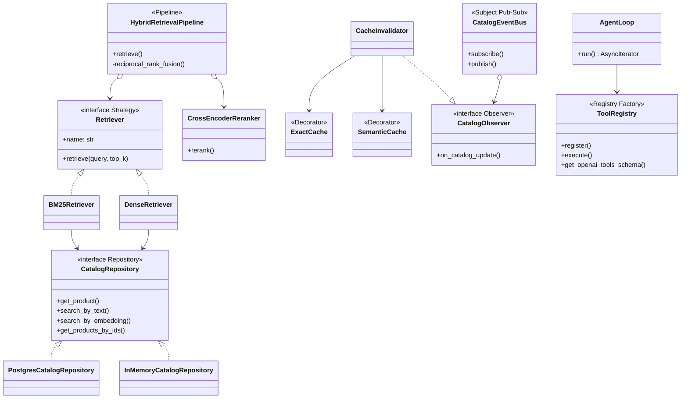

# Class Diagram — RAG Core

```mermaid
classDiagram
  class CatalogRepository {
    <<interface Repository>>
    +get_product()
    +search_by_text()
    +search_by_embedding()
    +get_products_by_ids()
  }
  class PostgresCatalogRepository
  class InMemoryCatalogRepository

  class Retriever {
    <<interface Strategy>>
    +name: str
    +retrieve(query, top_k)
  }
  class BM25Retriever
  class DenseRetriever

  class CrossEncoderReranker {
    +rerank()
  }
  class HybridRetrievalPipeline {
    <<Pipeline>>
    +retrieve()
    -reciprocal_rank_fusion()
  }

  class ExactCache {
    <<Decorator>>
  }
  class SemanticCache {
    <<Decorator>>
  }
  class CatalogObserver {
    <<interface Observer>>
    +on_catalog_update()
  }
  class CacheInvalidator
  class CatalogEventBus {
    <<Subject Pub-Sub>>
    +subscribe()
    +publish()
  }

  class ToolRegistry {
    <<Registry Factory>>
    +register()
    +execute()
    +get_openai_tools_schema()
  }
  class AgentLoop {
    +run() AsyncIterator
  }

  CatalogRepository <|.. PostgresCatalogRepository
  CatalogRepository <|.. InMemoryCatalogRepository
  Retriever <|.. BM25Retriever
  Retriever <|.. DenseRetriever
  BM25Retriever --> CatalogRepository
  DenseRetriever --> CatalogRepository
  HybridRetrievalPipeline o--> Retriever
  HybridRetrievalPipeline o--> CrossEncoderReranker
  CacheInvalidator ..|> CatalogObserver
  CatalogEventBus o--> CatalogObserver
  CacheInvalidator --> ExactCache
  CacheInvalidator --> SemanticCache
  AgentLoop --> ToolRegistry
```
