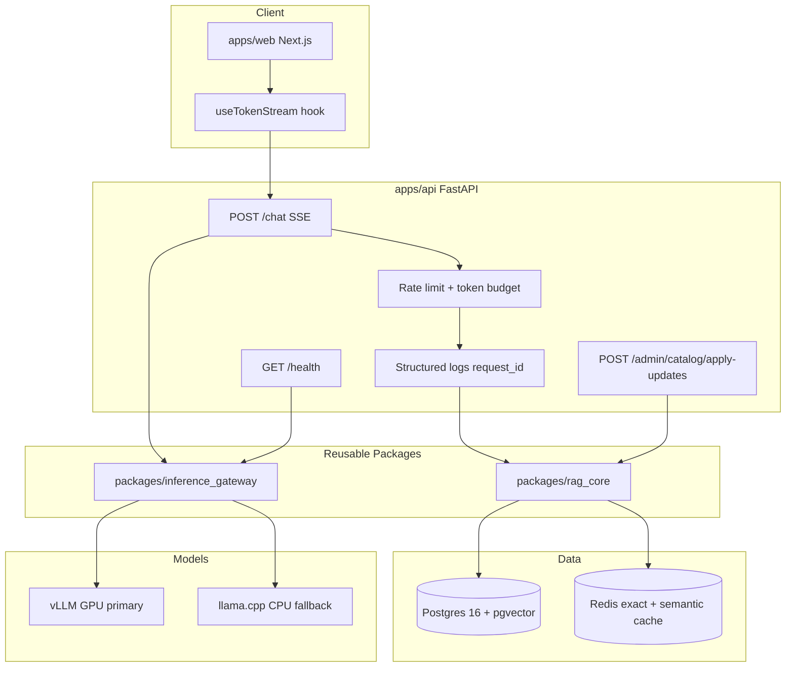

# Component Architecture Diagram

```mermaid
flowchart TB
  subgraph Client
    WEB[apps/web Next.js]
    HOOK[useTokenStream hook]
  end

  subgraph API["apps/api FastAPI"]
    CHAT[POST /chat SSE]
    HEALTH[GET /health]
    ADMIN[POST /admin/catalog/apply-updates]
    RL[Rate limit + token budget]
    LOG[Structured logs request_id]
  end

  subgraph Packages["Reusable Packages"]
    GW[packages/inference_gateway]
    RAG[packages/rag_core]
  end

  subgraph Data
    PG[(Postgres 16 + pgvector)]
    RD[(Redis exact + semantic cache)]
  end

  subgraph Models
    VLLM[vLLM GPU primary]
    LLAMA[llama.cpp CPU fallback]
  end

  WEB --> HOOK --> CHAT
  CHAT --> RL --> LOG --> RAG
  CHAT --> GW
  HEALTH --> GW
  ADMIN --> RAG
  RAG --> PG
  RAG --> RD
  GW --> VLLM
  GW --> LLAMA
```

**Reusability Boundary**: Packages under packages/ have independent pyproject.toml files and zero imports from apps/.
