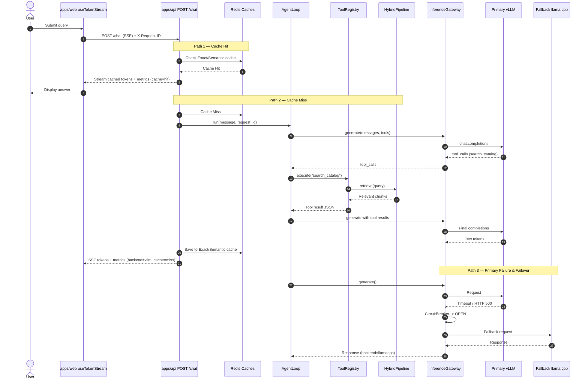

# Sequence Diagram — Chat Flow (3 Execution Paths)

```mermaid
sequenceDiagram
  autonumber
  actor User
  participant Web as apps/web useTokenStream
  participant API as apps/api POST /chat
  participant Cache as Redis Caches
  participant Agent as AgentLoop
  participant Tools as ToolRegistry
  participant RAG as HybridPipeline
  participant GW as InferenceGateway
  participant P as Primary vLLM
  participant F as Fallback llama.cpp

  User->>Web: Submit query
  Web->>API: POST /chat (SSE) + X-Request-ID

  Note over API,Cache: Path 1 — Cache Hit
  API->>Cache: Check Exact/Semantic cache
  Cache-->>API: Cache Hit
  API-->>Web: Stream cached tokens + metrics (cache=hit)
  Web-->>User: Display answer

  Note over API,RAG: Path 2 — Cache Miss
  API->>Cache: Cache Miss
  API->>Agent: run(message, request_id)
  Agent->>GW: generate(messages, tools)
  GW->>P: chat.completions
  P-->>GW: tool_calls (search_catalog)
  GW-->>Agent: tool_calls
  Agent->>Tools: execute("search_catalog")
  Tools->>RAG: retrieve(query)
  RAG-->>Tools: Relevant chunks
  Tools-->>Agent: Tool result JSON
  Agent->>GW: generate with tool results
  GW->>P: Final completions
  P-->>GW: Text tokens
  API->>Cache: Save to Exact/Semantic cache
  API-->>Web: SSE tokens + metrics (backend=vllm, cache=miss)

  Note over GW,F: Path 3 — Primary Failure & Failover
  Agent->>GW: generate()
  GW->>P: Request
  P--xGW: Timeout / HTTP 500
  GW->>GW: CircuitBreaker -> OPEN
  GW->>F: Fallback request
  F-->>GW: Response
  GW-->>Agent: Response (backend=llamacpp)
```
