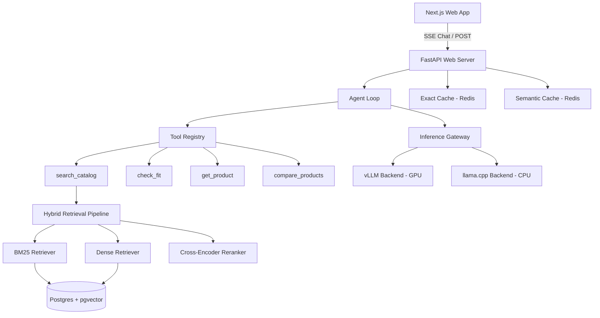

# System Architecture & Design Patterns

## Component Architecture

## Pattern Proof Summary

1. **Strategy Pattern**: `InferenceBackend` interface with `VLLMBackend`, `LlamaCppBackend`, `FakeBackend`.
2. **Adapter Pattern**: `GatewayAdapter` converting inference requests to agent response contracts.
3. **Decorator Pattern**: `MetricsBackend` and `RetryBackend` wrapping backends; `ExactCache` and `SemanticCache` wrapping retrieval.
4. **Circuit Breaker Pattern**: `CircuitBreaker` in `InferenceGateway` managing state transitions (CLOSED, OPEN, HALF_OPEN).
5. **Pipeline/Chain Pattern**: `HybridRetrievalPipeline` chaining BM25 + Dense + RRF + Cross-Encoder Reranker.
6. **Repository Pattern**: `CatalogRepository` interface with `PostgresCatalogRepository` and `InMemoryCatalogRepository`.
7. **Registry/Factory Pattern**: `ToolRegistry` and `@tool` decorator dynamically dispatching tools by name.
8. **Observer Pattern**: `CatalogEventBus` publishing updates to `CacheInvalidator` on catalog changes.
